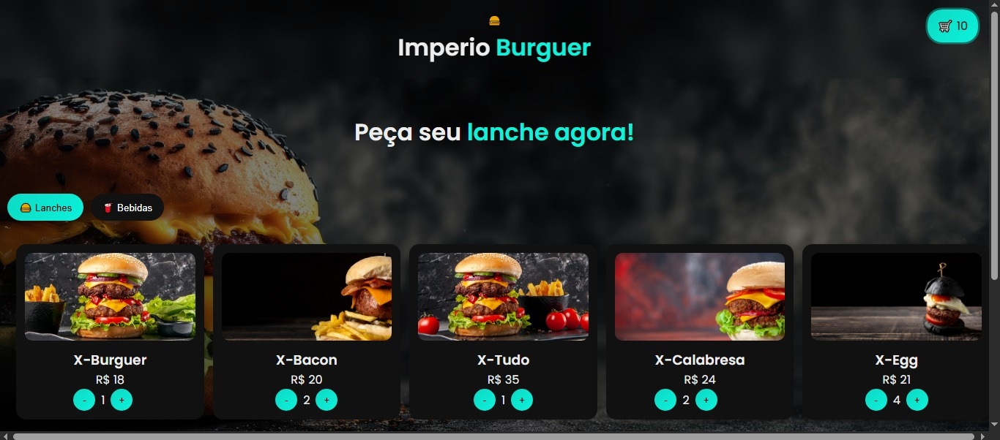
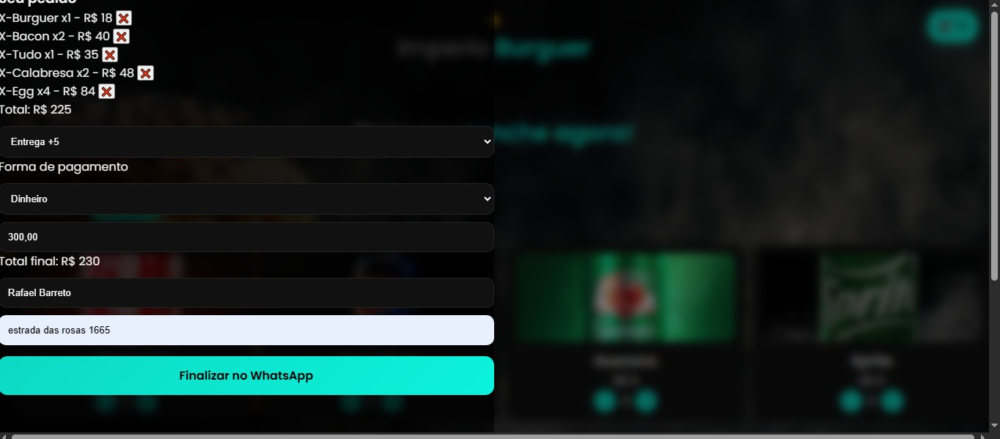
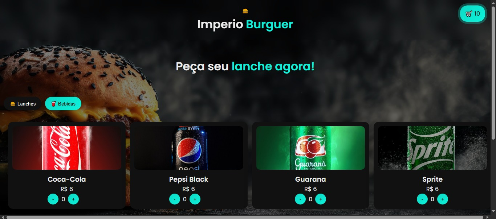
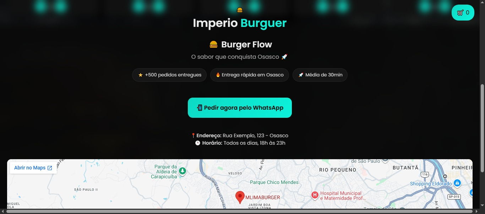

🍔 BurgerFlow

Sistema de pedidos online para hamburguerias com integração direta ao WhatsApp.
Simples, rápido e focado em conversão.

🚀 Demonstração

📱 Tela inicial

🛒 Carrinho de pedidos

🍔 Produtos e categorias

📍 Seção com mapa + CTA

🚀 Funcionalidades

🛒 Carrinho dinâmico  
➕ Adicionar/remover produtos   
💾 Salvamento automático (LocalStorage)   
📱 Totalmente responsivo   
💬 Pedido direto no WhatsApp   
💰 Cálculo automático de total + entrega   
🍔 Categorias de produtos   
🎯 Interface moderna com animações   

🧠 Tecnologias

HTML5   
CSS3   
JavaScript  
📂 Estrutura   
📁 burgerflow   
 ├── index.html   
 ├── styles.css   
 ├── script.js   
 └── 📁 img 

⚙️ Como usar

git clone [https://github.com/seu-usuario/burgerflow.git](https://github.com/rafaelbarreto95/Lanchonte)

Abra o index.html no navegador.

💬 WhatsApp

Altere o número no script.js:

const numero = "5511999999999";

🎨 Personalização

Produtos → index.html
Estilo → styles.css
Lógica → script.js

📈 Melhorias futuras

💳 Formas de pagamento   
💵 Cálculo de troco   
📊 Painel administrativo   
🔗 Integração com backend/API

💼 Uso

Perfeito para:

Hamburguerias 🍔   
Lanchonetes 🥤   
Delivery local 🚀   

👨‍💻 Autor

Rafael Barreto
📞 (11) 9.8378-6374

⭐ Contribua

Sinta-se livre para melhorar o projeto!
